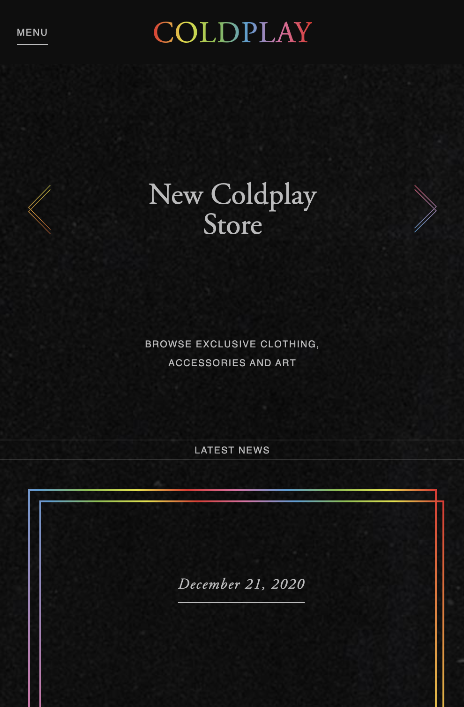
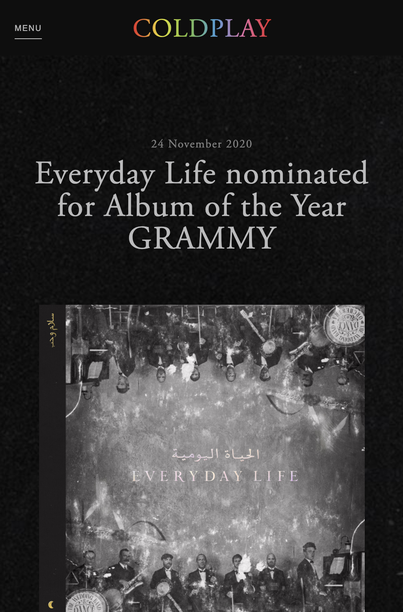
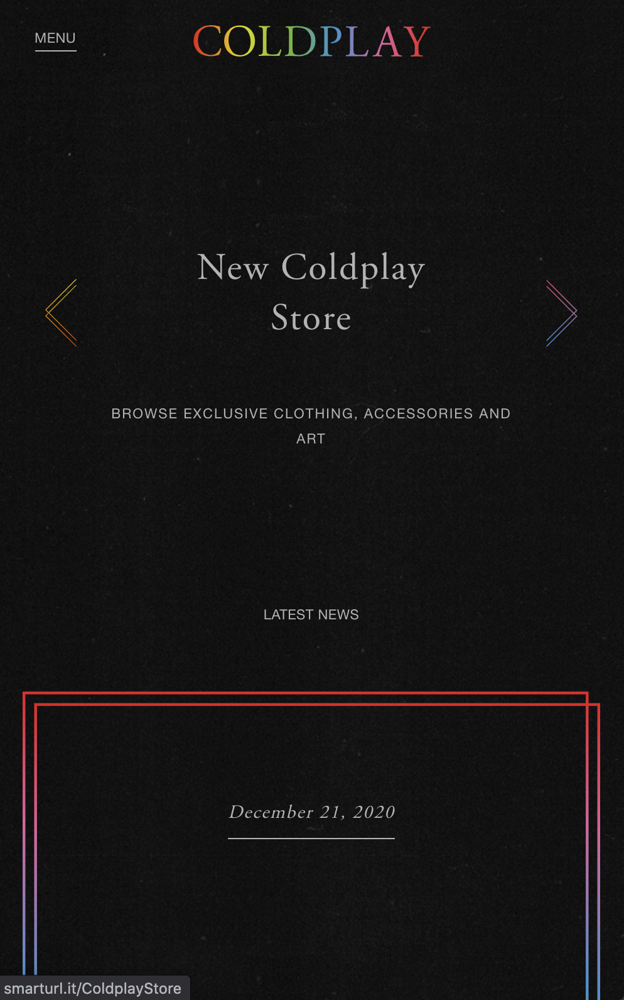
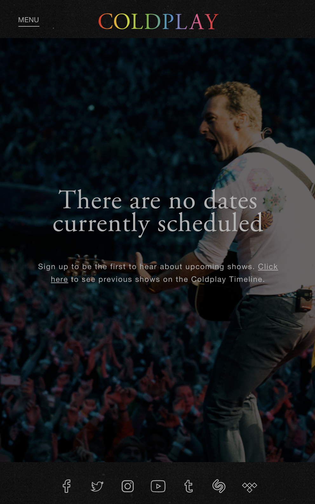

 https://rickdevos.github.io/webdev/.

# Procesverslag
**Auteur:** Rick de Vos

Markdown cheat cheet: [Hulp bij het schrijven van Markdown](https://github.com/adam-p/markdown-here/wiki/Markdown-Cheatsheet). Nb. de standaardstructuur en de spartaanse opmaak zijn helemaal prima. Het gaat om de inhoud van je procesverslag. Besteedt de tijd voor pracht en praal aan je website.

## Bronnenlijst
1. https://dev.to/saravanakumarputta/js-snippets-carousel-slider-using-plain-html-css-and-js-5fjc
2. 
3. 

## Eindgesprek (week 7/8)

Error: Bij uploaden van GITHUB waren alle images niet meer zichtbaar de enige oplossing die ik gevonden heb is om geen images map te gebruiken maar de images los in de map te gooien (niet optimaal). Het werkt wel gewoon. De geuploade map in dlo is geschikt voor github omdat de code voor images daar anders werkt.

Bijgewerkt voor herkansing:

- Html is beter gestructureerd door niet alleen div's te gebruiken maar ook sections en articles toe te passen op de content. Ook heb ik alle social media icons in flexbox gemaakt.
- In CSS waren veel code text verwijzingen gekopieerd waardoor het nu niet meer allemaal dubbelop gestyled is. (veel p tags lijken hetzelfde maar verschillen toch)
- Menu button = hover scale
- Social icons = hover scale + rotation
- Kleurvlakken = hover scale + 4 seconden delay bij site refresh + animation 0 tot 100 procent opacity
- Bijna volledig responsive (Het enige jammere op desktops is dat de article items met gradient stroke verspringen bij het openen en sluiten van het menu)

- Alles netjes op Github

Eerste kans feedback:

- Html moet niet alleen uit div bestaan probeer bijvoorbeeld article, sections.
- Css minder dubbel (class voor type selector)
- Github bijwerken zoals gevraagd in beoordelingformulier
- hovers / keyframes (kan in CSS)
- Social icons met flexbox

**Screenshot(s):**

## Feedback gesprek met Guus

- Probeer social icons toe te voegen aan de hand van flex
- maak een tweede pagina
- Linkje maken in tekst
- Background uit html en in css verwerken

Op de goede weg. Code ziet er netjes uit.

## Voortgang 3 (week 6)

-dit ging goed & dit was lastig-

Goed: De basis van de site staat. Ook is het gelukt om een gradient toe te voegen aan zowel het logo als de tekst items.
Lastig: De javascript code om van de header een carousel te maken is nog niet helemaal goed te begrijpen. Ik wil deze bron code versimpelen in mijn eigen javascript code. Ik merk dat ik hier was extra verdieping in nodig heb om het helemaal succesvol te maken. Ook zit er in het logo een gradient animatie. Dit is nog erg lastig voor mij. Toch wil ik mijzelf wel uitdagen om het in orde te krijgen. 

## Voortgang 2 (week 5)

-dit ging goed & dit was lastig-

Goed: Niet vast blijven houden aan ns.nl en een meer realistisch plan gemaakt. Mijn keuze is gevallen op de coldplay.com website. Deze is wat minimalistiser en voldoende uitdaging voor mijn niveau van code.
Lastig: Ik krijg de boven header niet "Fixed". Elke keer veranderd hij de locatie van het menu.

## Voortgang 1 (week 3)

### Stand van zaken

-dit ging goed & dit was lastig-

Goed: De html en css basis weer up to date krijgen (flexbox).
Lastig: Ik had gekozen voor NS.nl. Het instapniveau lag net iets te hoog waardoor ik veel tijd ben verloren.

**Screenshot(s):**

-screenshot(s) van hoe ver je bent met korte uitleg-

### Verslag van meeting

-na afloop snel uitkomsten vastleggen-

## Breakdownschets (week 1)

-uitwerken voor de 1e werkgroep - eind van de eerste week-

## Intake (week 1)
-uitwerken voor de kick-off werkgroep - begin van de eerste week-

**Je startniveau:** - Blauw / rood -

**Je focus:** - Micro interaties -

**Je opdracht:** - Coldplay.com -

**Screenshot(s) van de eerste pagina (small screen):**

**Screenshot(s) van de tweede pagina (small screen):**

